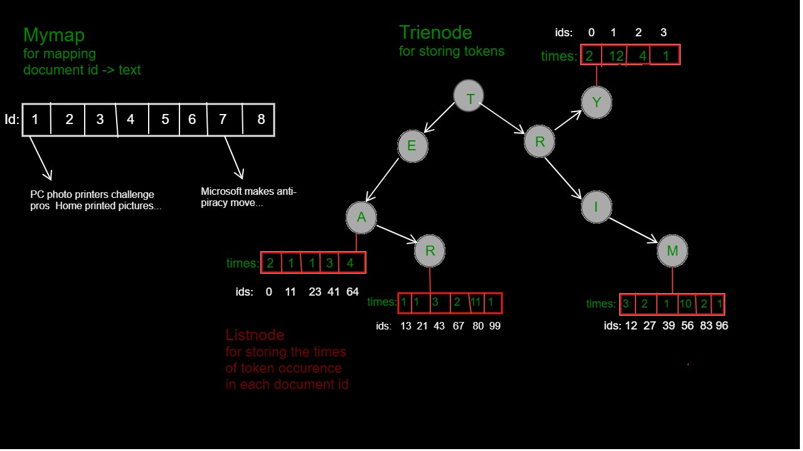

# T5 Text Search and Summarize Engine

A Searching and Summarizing Engine leveraging a custom-built search engine for news keyword searching, and a pre-trained transformers-based T5 Model, fine-tuned on news text and summary data to achieve state-of-the-art results on text summarization

# Table of Contents

- [T5 Text Search and Summarize Engine](#t5-text-search-and-summarize-engine)
- [Table of Contents](#table-of-contents)
- [1 Features](#1-features)
  - [1.1 Multiple T5 Text Summarization Models](#11-multiple-t5-text-summarization-models)
  - [1.2 Single Keyword Search](#12-single-keyword-search)
  - [1.3 Multiple Keyword Search](#13-multiple-keyword-search)
  - [1.4 Keyword Search and Summarize](#14-keyword-search-and-summarize)
- [2 Installation/Usage](#2-installationusage)
- [3 Project Overview](#3-project-overview)
  - [3.1 T5 Text Summarizer](#31-t5-text-summarizer)
    - [3.1.1 T5 Background](#311-t5-background)
    - [3.1.2 T5 Final Architecture](#312-t5-final-architecture)
    - [3.1.3 T5 Summarization Fine-Tuning](#313-t5-summarization-fine-tuning)
  - [3.2 Text Search Engine](#32-text-search-engine)
    - [3.2.1 Text Dataset Architecture](#321-text-dataset-architecture)
    - [3.2.2 Text Search Logic](#322-text-search-logic)
- [4 Current Issues](#4-current-issues)
- [5 Contributing](#5-contributing)
- [6 Roadmap](#6-roadmap)
- [7 Acknowledgements](#7-acknowledgements)
- [8 License](#8-license)

# 1 Features

## 1.1 Multiple T5 Text Summarization Models

The `Summarizing` functionality of program allows the user to enter a text with more than 50 words in the `text_area`, choose single/multiple models to be used for summarization at once and adjust the `Maximum Summary Length`. The program will load the model from checkpoint, and summarize the text in less than a minute.

Current supported summarization models:

- t5-small
- t5-base

## 1.2 Single Keyword Search

The `Searching` functionality of the program allows the user to enter a single keyword in the search `text_input`, choose the `Maximum Searched Results` to be displayed and wait for the search engine to find the occurrences of the keyword in the news/articles dataset and display them with a custom ranking scheme dependent of the number of occurrences.

## 1.3 Multiple Keyword Search

The `Searching` functionality of the program allows the user to enter multiple keywords either in the format of `keyword_1,keyword_2>` or `<keyword_1 keyword_2>` in the search `text_input`, choose the `Maximum Searched Results` to be displayed and wait for the search engine to find the occurrences of the keyword in the news/articles dataset and display them with a custom ranking scheme dependent of the number of occurrences. (**Note:** the search engine will consider each `<keyword>` separately and not as a whole)

## 1.4 Keyword Search and Summarize

The `Searching` and `Summarizing` functionalities can also be used together by allowing the user to enter single/multiple keywords in the search `text_input`, choose the `Maximum Searched Results` to be displayed, choose single/multiple models to be used for summarization at once and adjust the `Maximum Summary Length`. Upon displaying search results, clicking on the `Summarize` button underneath the displayed results will summarize the text of the displayed document by loading the model from checkpoint and summarizing the text in less than a minute.

# 2 Installation/Usage

coming soon

# 3 Project Overview

T5 Text Search and Summarize Engine has two core components, a **Transformer-Based Pre-Trained T5 Model Fine-Tuner** used for text summarization and a **Token-Based Text Searcher**.

The primary use of this project is for news text summarization, however, it can be expanded for any type of natural language summarization.

## 3.1 T5 Text Summarizer

The T5 Text Summarizer part of this project uses the pre-trained PyTorch `transformers.ioT5ForConditionalGeneration` model from the [Hugging Face API](https://huggingface.co/transformers/model_doc/t5.html) and [PyTorch Lightning](https://pytorch-lightning.readthedocs.io/en/latest/) research framework for handling cross-hardware training, model check-pointing and logging.

T5 model can be used for wide range of NLP tasks such as Translation, Summarization, Classification, Regression and Q&A, if fine-tuned with a dataset relevant to the desired task.

To see how T5 is able to achieve these results, a brief explanation of the [background](#311-t5-background) and [architecture](#312-t5-final-architecture) behind T5 is provided below.

### 3.1.1 T5 Background

[T5](https://arxiv.org/abs/1910.10683) (**T**ext-**t**o-**T**ext **T**ransfer **T**ransformer) model is a result of a systematic study conducted by Google researchers as presented in [Exploring the Limits of Transfer Learning with a Unified Text-to-Text Transformer](https://arxiv.org/abs/1910.10683) by Colin Raffel, Noam Shazeer, Adam Roberts, Katherine Lee, Sharan Narang, Michael Matena, Yanqi Zhou, Wei Li, Peter J. Liu.

In their study, researchers start with a baseline model roughly equivalent to the [original Transformer](https://arxiv.org/abs/1706.03762) proposed by [Vaswani et al. (2017)](https://arxiv.org/abs/1706.03762) with 3 main exceptions of removing the Layer Norm bias, placing the layer normalization outside residual path and using a different position embedding scheme.

For training, T5 uses [C4](tensorlow.text.c4) dataset, a heuristic filtered version of common crawl web extracted text. In filtering, any line that didn’t end in a terminal punctuation mark, or containing the word javascript or any pages that had a curly bracket get removed. Dataset is then deduplicated by taking a sliding window of 3 sentence chunks so that only one of them appeared. C4 ends up with roughly 750 gigabytes of clean-ish English text.

The final T5 model is obtained by **altering the model setup one aspect at a time** and **choosing the option with the best performance**.

### 3.1.2 T5 Final Architecture

- **Input and Output Format** T5 uses a "text-to-text" format to provide a consistent training objective for the diverse set of tasks described in part [3.1 T5 Text Summarizer](#31-t5-text-summarizer), i.e. input is "translate English to German: That is good" and the output is "Das ist gut".
   
- **Objective** Finalized T5 base model's objective is the span-corruption objective with a span length of 3 and corruption rate of 15% of the original sequence, inspired by SpanBert ([Joshiet al., 2019](https://arxiv.org/abs/1907.10529))
   
- **Longer training** Finalized T5 base model uses a batch size of $2^{11}$ sequences of length 512 and training steps of 1 million steps, corresponding to a total of 1 trillion pre-training tokens
   
- **Model sizes** Finalized T5 model is available in following sizes:
  - **Base.** 12-headed attention, 12 layers in each encoder and decoder with 220 million parameters
  - **Small.** 8-headed attention, 6 layers in each encoder and decoder with 60 million parameters
  - **Large.** 16-headed attention, 24 layers in each encoder and decoder with 770 million parameters
  - **3B.** 32-headed attention 24 layers in each encoder and decoder with 2.8 billion parameters
  - **11B.** 128-headed attention 24 layers in each encoder and decoder with 11 billion parameters
     
- **Fine-tuning** The finalized T5 model is fine-tuned with a batch size of 8 length-512 sequences for each GLUE and SuperGlue tasks with checkpoints being saved every 1,000 steps.
   
- **Beam Search** Finalized T5 model uses beam search with a beam width of 4 parameters and a length penalty of 0.6 for the WMT translations and CNN/DM summarization tasks.

Overall performance of finalized T5 Models is shown in the figure below.

### 3.1.3 T5 Summarization Fine-Tuning

For fine-tuning T5 for the task of news summarization, a [news_summary dataset](https://www.kaggle.com/sunnysai12345/news-summary) with +4500 news texts and summaries has been used.

Hyper-parameters used for fine-tunning:

- **For tokenization**
  - text_max_token_len: 512 tokens
  - summary_max_token_len: 128 tokens
  - padding: "max_length"
  - truncation: True
  - add_special_tokens: True
     
- **For Fine-Tuning**
  - epochs: 3
  - batch_size: 8
  - test_size: 0.1
     
- **For Summarization**
  - max_length: adjustable (default=150)
  - num_beams: 2
  - repetition_penalty: 1.0
  - length_penalty: 1.0
  - early_stopping: True

Currently, only two of [Hugging Face](https://huggingface.co/transformers/model_doc/t5.html) T5 models are fine-tuned which are `t5-small` trained with GPU(PyTorch CUDA) and `t5-base` trained with Google's 8-core v2 TPU.

## 3.2 Text Search Engine

The Text Searching Engine is developed purely in `C` and `C++` for optimized speed and memory handling. The search engine is initialized with a static dataset containing thousands of news and articles rendered from the web.
After initialization, the search engine is tasked with searching for a certain word in the dataset and display the documents(news) containing the searched keyword with a custom ranking scheme.

### 3.2.1 Text Dataset Architecture

The dataset initialization is achieved by leveraging `Trie` for storing tokens (denoted as `Trienode`) and `Linked List` data structures for mapping document id to news/document text (denoted as `Mymap`) and storing times of occurrences of each token in all news/document ids(denoted as `Listnode`).

### 3.2.2 Text Search Logic

Text searching is achieved through main functionalities:

1. `/tf` : given a `<key-word>` and a document `<id>`, will search the `<keyword>` token in the `Trienode` and retrieve the times of occurrences for the corresponding `<id>` of the token's `<Listnode>`, ultimately returning the number of times the `<key-word>` has been detected in document with id `<id>`. (not supported by the web-interface)
    
2. `/df` : given a `<key-word>`, will leverage the `/tf` function to search through all the documents and return the total number of times the `<key-word>` has been detected in the whole dataset. (not supported by the web-interface)
    
3. `/search`: given a set of `<keyword1,keyword2,..>` will leverage `/tf` search to find the number of occurrences of each keyword in documents, calculate a logarithmic score for ranking scheme and store it in a list(denoted as `Scorelist`) and finally display the results in a descending order of scores which is achieved through transforming the `Scorelist` to a `Maxheap` structure, and removing highest score one at a time. (supported by the web-interface)

# 4 Current Issues

- Searching dataset initialization takes place before each new search, reducing the searching speed
- Model loading from checkpoint also happens before each summarization task
- Constant, non-configurable `text_max_token_len` of 512 and `summary_max_token_len` of 128 as suggested by the original [T5](https://arxiv.org/abs/1910.10683) paper, limit the word-range of input and output text

# 5 Contributing

Contributions are always welcome!

A detailed guide about project specifics and in-depth architecture analysis will be released soon.

# 6 Roadmap

- Fixing Issues:

  - Avoid searching dataset initialization from happening before each search by either running both the text summarization and searching engines in a parallel setup or storing search dataset in a database.
  - Load model from checkpoint only once at the beginning of the program or just before the first summarization prompt
  - Add configurable `text_max_token_len` and `summary_max_token_len` to increase text word-range flexibility.

- New Features:
  - Fine-tune T5 Models with higher number of parameters such as `t5-large` and `t5-3B` for better results.
  - Add other NLP models such as `BERT` and `ALBERT` for performance comparison.
  - Add a web news scrapper to maintain an up-to-date version of latest most popular `n` news.

# 7 Acknowledgements

T5 Text Summarizer

- [Exploring the Limits of Transfer Learning with a Unified Text-to-Text Transformer](https://arxiv.org/abs/1910.10683)
- [Attention Is All You Need](https://arxiv.org/abs/1706.03762)
- [Hugging Face T5 API](https://huggingface.co/transformers/model_doc/t5.html)
- [PyTorch Lightning Trainer](https://pytorch-lightning.readthedocs.io/en/latest/common/trainer.html)
- [Text Summarization with T5](https://www.youtube.com/watch?v=KMyZUIraHio)

Search Engine

- [Building a Search Engine with C++](https://www.education-ecosystem.com/nikos_tsiougkranas/ljJg5-how-to-build-a-search-engine-in-c/yDd46-intro-how-to-build-a-search-engine-in-c/)

# 8 License

This project is licensed under the terms of the [MIT](https://en.wikipedia.org/wiki/MIT_License) license.
